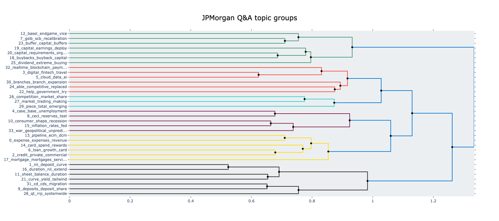
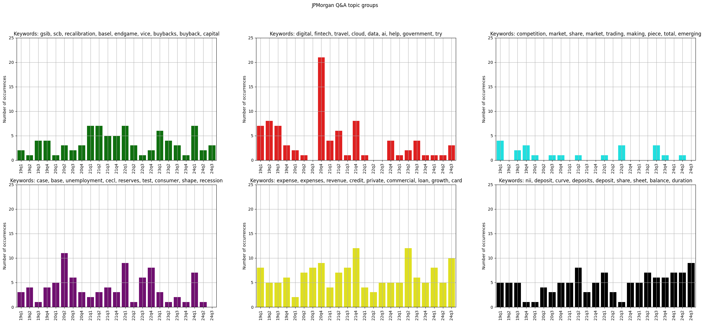
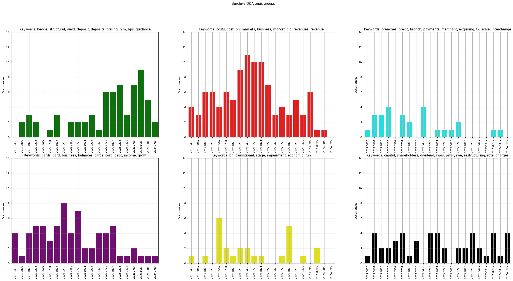

# Topic modelling with BERTopic from transcripts of financial quarterly review Q&amp;A sessions

BERTopic analysis was applied on Q&A transcripts from JPMorgan and Barclays. BERTopic uses text embeddings directly, and no prompt fine tuning is possible. However, access to inter-topic distance measurement metrics, and mappings between topic and documents is provided. These techniques were employed together to get a top-level breakdown of topics and trends.

For JPMorgan Q&A transcripts of five years, BERTopic identified thirty topics. These were grouped using a cosine similarity metric with the formula $d = 1 - cos(t)$, where a score of 0 means topics were nearly identical, and a score of 2 means they were completely uncorrelated.

The scores were thresholded at 1 for cluster separation.

By back-referencing the documents grouped in each cluster, a timeline of topic occurrence was constructed.

The following observations were inferred for JPMorgan Q&A topic timeline:
- Recession and unemployment discussed mid 2020 (purple cluster)
- Initiative to use customer data with AI for additional services greatly discussed end of 2020, but trailing off the following years (red cluster)

Similar analysis was run given for Barclays Q&A transcripts.

The following observations were inferred for Barclays Q&A topic timeline:
- Recession and unemployment discussed mid 2020 (yellow cluster)
- Concern for branches closing and workforce moving to Europe following Brexit across 2019, 2020, and H1 2021 (cyan cluster)

